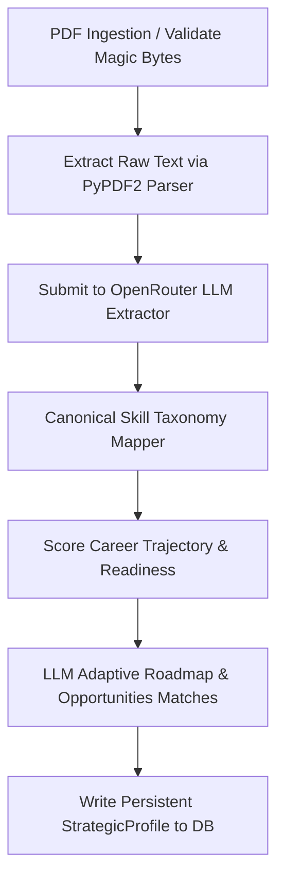

# AI Career Strategy Pipeline & OpenRouter LLM Operations

This document defines the real AI-driven pipeline, LLM orchestration layers, database persistence models, and fallback operations in the ResuMatch career platform.

---

## 1. Real Resume Extraction Pipeline

ResuMatch processes raw resumes via a multi-stage ingestion and extraction flow:



### Pipeline Modules:
* **`parser.py`**: Extracts raw text from uploaded PDF files safely, enforcing size limits (50KB) and page limits (10 pages) to ensure compile-time safety.
* **`extractor.py`**: Interacts with the `OpenRouterLLMService` to extract metadata, skills, experience with skills-used, certifications, and target specialization details.
* **`skill_mapper.py`**: Maps raw skill terms onto standardized taxonomies using the `normalize_skills` mapper to ensure consistent trajectories.
* **`role_inference.py`**: Plugs normalized skills into the trajectory engine to compute readiness scores and specialization momentum.
* **`profile_builder.py`**: Integrates the end-to-end flow. Persists a comprehensive `StrategicProfile` record to the database, syncing it across legacy tables.

---

## 2. Centralized OpenRouter LLM Service
All AI generation tasks are consolidated inside `provider.py` to prevent scattered calls and duplicate prompt code.

* **Key Client Class**: `OpenRouterLLMService` (using `httpx.AsyncClient`).
* **Environment Configuration**:
  - `OPENROUTER_API_KEY`: API authorization token.
  - `OPENROUTER_MODEL`: Primary instruction model (defaults to `meta-llama/llama-3.1-8b-instruct:free`).
* **Resilience Framework**:
  - **Retries**: Retries up to 3 times on network connection failures and rate limits (HTTP 429), utilizing an exponential backoff mechanism.
  - **Failover Cascades**: If the primary model fails or experiences extreme latency, the client swaps to `google/gemma-7b-it:free` and `mistralai/mistral-7b-instruct:free` sequentially.
  - **JSON Formatting Safeguards**: Appends strict JSON formatting prompts, cleans markdown blocks (` ```json `), and returns secure schema-level dictionaries if the model returns invalid text.

---

## 3. Database Strategic Profile Persistence
The `strategic_profiles` SQL table serves as the single persistent source of truth for candidate vectors:

```python
class StrategicProfile(Base):
    __tablename__ = "strategic_profiles"
    user_id = Column(String(36), ForeignKey("users.id"), primary_key=True)
    inferred_skills = Column(JSON)
    active_specialization = Column(String)
    target_role = Column(String)
    roadmap_progress = Column(JSON)
    opportunity_alignment = Column(JSON)
    market_alignment = Column(Float)
    ai_recommendations = Column(JSON)
    trajectory_state = Column(JSON)
    calibration_history = Column(JSON)
    recruiter_signals = Column(JSON)
```

Both computed summaries (`/v1/intelligence/summary`) and opportunities (`/v1/opportunities/matches`) endpoints check and hydrate directly from this persistent record, bypassing simulated fallbacks once a user parses their credentials.

---

## 4. Conversational Copilot Context Memory
The Career AI Workspace features multi-turn conversation memory. Rather than acting as a generic chat wrapper, it retrieves details directly from the user's `StrategicProfile` and `WorkspaceMessage` history to act as an elite career strategist.

### Dynamic Prompt Context:
* **System Prompt**: Embeds target role, active validated competencies, outstanding gaps, and top matching opportunities dynamically.
* **Turn Memory**: Fetches up to the last 10 conversational turns dynamically using `WorkspaceRepository.get_messages(session_id)` to preserve complete contextual multi-turn dialogue.
