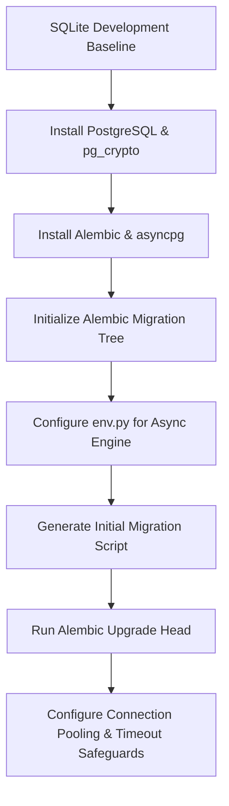

# Database Migration Strategy — PostgreSQL Transition Pathway

This document outlines the operational roadmap, Alembic setups, and database pooling configurations required to scale ResuMatch from development SQLite to a production-grade PostgreSQL service.

---

## 🗺️ 1. Migration Roadmap



---

## 🛠️ 2. Step-by-Step Transition Setup

### Step A: Dependency Ingestion
Install required PostgreSQL async driver and migration framework libraries:
```powershell
.\venv\Scripts\python -m pip install alembic asyncpg
```

### Step B: Initialization
From the `backend` workspace root, initialize Alembic config directories:
```powershell
alembic init -t async migrations
```
This generates:
- `alembic.ini`: Primary configuration interface.
- `migrations/env.py`: Execution context script that defines target engine connectivity and imports model schemas.
- `migrations/script.py.mako`: Template for future migration revision scripts.

### Step C: Configuration Tuning
1. In `alembic.ini`, dynamic configuration from environment variables is prioritized over hardcoded strings. Clear the `sqlalchemy.url` line or configure it to load dynamically.
2. In `migrations/env.py`, import model schema metadata to enable schema auto-generation:
```python
# migrations/env.py
from app.db import Base  # Your SQLAlchemy declarative base class
from app.models.strategic_profile import StrategicProfile  # Load all models for introspection
# Set target metadata
target_metadata = Base.metadata
```

### Step D: Auto-generation of Migrations
To auto-generate migration files by introspecting existing database states against declarative Python models:
```powershell
alembic revision --autogenerate -m "Initial strategic schema"
```
Review the created python migration script under `migrations/versions/` for safety before applying changes.

### Step E: Applying Schema Changes
To execute all pending migrations and align the production database to the current codebase baseline:
```powershell
alembic upgrade head
```

---

## 🌊 3. Connection Pooling & Safeguard Configurations

When executing async database sessions under high concurrent recruiter workloads, standard pooling parameters must be configured in `app/db.py` to prevent thread exhaustion or socket leaks.

Configure the `create_async_engine` factory with these parameters:

```python
from sqlalchemy.ext.asyncio import create_async_engine

# Production Engine Configuration Parameters
async_engine = create_async_engine(
    DATABASE_URL,
    pool_size=20,           # Max steady connections kept in pool
    max_overflow=10,        # Temporary extra connections allowed under surge
    pool_timeout=30,        # Time to wait (seconds) before throwing checkout error
    pool_recycle=1800,      # Prevent stale socket drops by recycling every 30m
    pool_pre_ping=True      # Check connection health before checking out
)
```

---

## ⚠️ 4. Production Safeguards & Pre-Flight Checks

Before applying PostgreSQL transitions in live staging or production clusters, ensure the following constraints are strictly validated:

1. **Schema Exclusivity**: Never combine development SQLite schema initialization tables (`metadata.create_all()`) with Alembic upgrades in production. Set a condition `if not settings.is_production` on automatic creations.
2. **Encrypted Credentials**: Ensure the Postgres password in `DATABASE_URL` is injected securely via Kubernetes Secrets or Docker secrets, not stored in source files.
3. **Data Loss Prevention**: Always run a database snapshot back-up before performing an `alembic upgrade head` in production.
