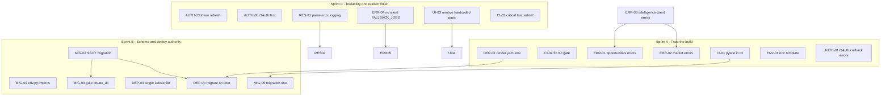

# Skillyn Phase Closure Plan

**Source:** [phase_audit_report.md](./phase_audit_report.md), [phase_matrix.json](./phase_matrix.json), [phase_gap_backlog.md](./phase_gap_backlog.md)
**Date:** 2026-06-22
**Goal:** Close **operational trust** gaps (Phase 9/10/11) before any intelligence/orchestration refactor.

---

## Scope boundary (explicit out-of-scope)

Do **not** start these until Phase 9/10 closure is done:

| Out of scope now | Why |
|------------------|-----|
| Phase 7 orchestration refactor | Audit: schema-rich, runtime-light; not blocking user journeys |
| Dual event bus consolidation (`agents/shared/event_bus.py`, `propagation/event_bus.py`) | Architecture cleanup, not release trust |
| Agent coordinator / replay / convergence runtime wiring | Sandbox APIs already gated in prod (`backend/app/routers/__init__.py`) |
| New intelligence features | Violates `.agents/rules/reliabilityoverfeatures.md` |

**Principle:** Fix **CI authority**, **migration authority**, **deploy authority**, and **error visibility** first. Internal architecture polish without those four is wasted effort.

---

## Section A — Phase 9/10 closure tasks

### A1 — CI fixes (Phase 9.3)

| Task ID | Pri | Files | Action | Acceptance | Deps | Ref |
|---------|-----|-------|--------|------------|------|-----|
| **CI-01** | P0 | `.github/workflows/ci.yml` | Add backend **Test** step after import check: `cd backend && pip install -r requirements-dev.txt && pytest -q --timeout=30` with `ENV=testing`, `DATABASE_URL=sqlite+aiosqlite:///./test.db`, `JWT_SECRET=ci-test-secret-minimum-16` | PR fails on test regression | — | G-001 |
| **CI-02** | P0 | `.github/workflows/ci.yml` | Remove `\|\| true` from frontend typecheck step (line ~48) | `npx tsc --noEmit --skipLibCheck` must pass or CI fails | — | G-004 |
| **CI-03** | P1 | `.github/workflows/ci.yml` | Add **critical subset** job or marker: `pytest -q -m "not slow"` OR explicit file list: `test_auth_endpoints.py`, `test_resume_lifecycle.py`, `test_opportunities_endpoints.py`, `test_strategic_profile_consistency.py`, `test_opportunity_normalize.py`, `test_strategic_profile_years.py` | Fast PR gate &lt; 3 min | CI-01 | G-001 |
| **CI-04** | P2 | `.github/workflows/ci.yml` | Optional nightly / `workflow_dispatch` job: full `pytest` + `test_perf_baseline.py` with relaxed thresholds | Perf regressions visible, not blocking every PR | CI-01 | G-019 |
| **CI-05** | P2 | `frontend/package.json`, `.github/workflows/ci.yml` | Add minimal Jest smoke: `ProtectedRoute` redirect + `normalizeOpportunityMatch` unit test; run in frontend job | At least 2 frontend tests in CI | CI-02 | G-030 |

**Blockers:** CI-02 may fail immediately — fix type errors in touched files only; do not broad-refactor.

---

### A2 — Migration authority fixes (Phase 1.2 + 10.2)

| Task ID | Pri | Files | Action | Acceptance | Deps | Ref |
|---------|-----|-------|--------|------------|------|-----|
| **MIG-01** | P0 | `backend/migrations/env.py` | Ensure all SSOT models import in `env.py` (mirror `main.py` lifespan imports) | `alembic revision --autogenerate` sees strategic/roadmap/workspace tables | — | G-002 |
| **MIG-02** | P0 | `backend/migrations/versions/` | New revision: `strategic_profiles`, `user_progress`, `roadmap_states`, `roadmap_events`, `workspace_sessions`, `workspace_messages` (minimum SSOT set) | `alembic upgrade head` on empty Postgres creates product tables | MIG-01 | G-002 |
| **MIG-03** | P0 | `backend/app/main.py` | Gate `create_all`: run only when `settings.env == Environment.testing` OR explicit `DEV_CREATE_ALL=true`; production uses Alembic only | Fresh prod deploy does not rely on `create_all` | MIG-02 | G-003 |
| **MIG-04** | P1 | `backend/migrations/versions/a1ab61b412a5_add_user_progress_unique_user_id.py` | Fix ordering: ensure `user_progress` table created in MIG-02 before unique index migration | `alembic upgrade head` from empty DB succeeds | MIG-02 | G-002 |
| **MIG-05** | P1 | `backend/tests/` | Add `test_migrations_fresh_db.py`: spin up test engine, run `alembic upgrade head`, smoke-query `strategic_profiles` | Migration path tested in CI | MIG-02, CI-01 | G-002 |
| **MIG-06** | P2 | `docs/database-strategy.md`, `README.md` | Document: **Alembic is schema authority**; `create_all` is testing-only | Docs match runtime behavior | MIG-03 | G-002 |

**Do not** migrate Phase 7 memory/agent/orchestration tables in this sprint — only SSOT product tables.

---

### A3 — Deploy env fixes (Phase 10.1 + 10.3)

| Task ID | Pri | Files | Action | Acceptance | Deps | Ref |
|---------|-----|-------|--------|------------|------|-----|
| **DEP-01** | P0 | `render.yaml` | Replace `GEMINI_API_KEY` with `OPENROUTER_API_KEY`; add `REDIS_URL`, `OPENROUTER_MODEL`; fix `CORS_ORIGINS` to comma-separated (matches `config.py` parser) | Render env matches `backend/app/config.py` production validators | — | G-006 |
| **DEP-02** | P0 | `render.yaml` | Rename service/db labels from `resumatch-*` to `skillyn-*` (or document intentional legacy DB name) | No deploy-time confusion with Skillyn branding | — | G-029 |
| **DEP-03** | P1 | `Dockerfile`, `backend/Dockerfile.prod`, `.github/workflows/ci.yml` | **Pick one canonical prod image** (recommend root `Dockerfile` for Render; CI builds same file) | Single Dockerfile path in docs + CI + Render | — | G-021 |
| **DEP-04** | P1 | `backend/Dockerfile.prod` OR root `Dockerfile` | Add `alembic upgrade head` before uvicorn/gunicorn CMD | Container boot applies migrations | MIG-02, DEP-03 | G-003 |
| **DEP-05** | P2 | `docker-compose.yml` | Optional comment block: infra-only; link to `docs/dev-bootstrap.md` | README/compose aligned | — | G-029 |
| **DEP-06** | P2 | `.github/workflows/ci.yml` | Add deploy workflow stub OR document manual Render deploy checklist in `docs/dev-bootstrap.md` | Deploy steps written, not tribal knowledge | DEP-01 | — |

---

### A4 — Runtime env contract fixes (Phase 10.2 + 9.2)

| Task ID | Pri | Files | Action | Acceptance | Deps | Ref |
|---------|-----|-------|--------|------------|------|-----|
| **ENV-01** | P0 | `backend/.env.example` | Add `SENTRY_DSN=` (optional), document `REDIS_URL` required for multi-worker prod | Template matches `config.py` fields | — | G-006 |
| **ENV-02** | P1 | `backend/requirements.txt` | Pin optional prod deps used in code: `sentry-sdk`, `prometheus-client`, `prometheus-fastapi-instrumentator` OR remove optional imports from `main.py` | No silent ImportError for observability in prod | — | G-020 |
| **ENV-03** | P1 | `backend/app/config.py` | Add startup validation log: Redis reachable (warning if down), OpenRouter key present in production | `/health` or startup logs show contract status | ENV-01 | G-023 |
| **ENV-04** | P1 | `backend/app/main.py` | Call `close_redis()` on shutdown if `infrastructure/redis.py` exposes it | Clean shutdown, no leaked connections | — | — |
| **ENV-05** | P2 | `frontend/src/lib/env.ts` | Verify `NEXT_PUBLIC_API_URL` documented for Vercel; align with `render.yaml` `FRONTEND_URL` | OAuth redirect + CORS consistent | DEP-01 | — |
| **ENV-06** | P2 | `docs/auth-setup.md` | Sync Google redirect URI: `GOOGLE_REDIRECT_URI` / `OAUTH` naming with `backend/.env.example` | One canonical OAuth env var name in docs | — | — |

---

## Section B — Phase 11 closure tasks

### B1 — OAuth reliability (Phase 11.1 + 1.3)

| Task ID | Pri | Files | Action | Acceptance | Deps | Ref |
|---------|-----|-------|--------|------------|------|-----|
| **AUTH-01** | P0 | `frontend/src/app/(auth)/auth/callback/page.tsx` | Handle `?error=` query params from backend redirect; show user-visible message + link to retry | Failed OAuth does not spin forever | — | — |
| **AUTH-02** | P0 | `frontend/src/app/(auth)/login/page.tsx` | Read `error` / `detail` from URL; map `oauth_failed`, `oauth_not_configured` to toast/banner | User sees why Google login failed | AUTH-01 | — |
| **AUTH-03** | P1 | `frontend/src/auth/AuthContext.tsx`, `frontend/src/auth/api.ts` | Wire `refreshToken()` before expiry (or on 401): call `/v1/auth/refresh`, update `localStorage` | Session survives without forced re-login within refresh window | — | G-010 |
| **AUTH-04** | P1 | `frontend/src/components/SessionManager.tsx` | Coordinate with AUTH-03: refresh before logout toast when refresh succeeds | No logout flash on recoverable 401 | AUTH-03 | G-010 |
| **AUTH-05** | P1 | `backend/tests/test_auth_oauth_callback.py` (new) | Mock Authlib token exchange + callback redirect; assert JWT cookie/query token | OAuth path covered in CI | CI-01 | G-011 |
| **AUTH-06** | P2 | `backend/app/routers/auth.py` | Ensure `FRONTEND_URL` / session `oauth_frontend_url` used consistently on all error redirects | Local dev on `:3001` works first attempt | AUTH-01 | — |
| **AUTH-07** | P2 | `docs/auth-setup.md`, `backend/.env.example` | Document required Google console origins for `localhost:3001` and production frontend | Matches `.agents/rules/performancetargets.md` OAuth 100% target | — | — |

---

### B2 — Resume upload / parse reliability (Phase 11.1 + 2.x)

| Task ID | Pri | Files | Action | Acceptance | Deps | Ref |
|---------|-----|-------|--------|------------|------|-----|
| **RES-01** | P0 | `backend/app/services/resume_service.py` | Audit `except Exception` blocks: ensure `logger.exception` + `parse_status=failed` + user-visible error in API response | No silent parse failures | — | — |
| **RES-02** | P0 | `backend/app/routers/resumes.py` | Return structured error on parse failure (`detail`, `parse_status`); never 200 with empty profile | Frontend can show failure state | RES-01 | — |
| **RES-03** | P1 | `frontend/src/app/(app)/resumes/page.tsx` | Show failed parse status with retry CTA; link to re-upload | User sees failure, not infinite spinner | RES-02 | — |
| **RES-04** | P1 | `frontend/src/app/(app)/profile/page.tsx` | On load, if `parsingStatus` stuck, surface timeout message (poll cap already 60s) | Profile page explains stalled parse | RES-02 | — |
| **RES-05** | P1 | `backend/tests/test_resume_lifecycle.py` | Extend: assert `parse_status=failed` propagates to GET resume | Regression test in CI | CI-01, RES-01 | — |
| **RES-06** | P2 | `backend/app/services/resume_pipeline/profile_builder.py` | Ensure `years_of_experience` always seeded in `trajectory_state` on parse (already partially done) | GET profile returns sane years after upload | MIG-02 | G-014 |

---

### B3 — Opportunities / market error surfacing (Phase 11.1 + 3.5 + 5.3)

| Task ID | Pri | Files | Action | Acceptance | Deps | Ref |
|---------|-----|-------|--------|------------|------|-----|
| **ERR-01** | P0 | `frontend/src/app/(app)/opportunities/page.tsx` | Replace silent `catch` (~line 57) with `fetchError` state + retry button (mirror dashboard pattern) | User sees API failure | — | G-005 |
| **ERR-02** | P0 | `frontend/src/app/(app)/market-intelligence/page.tsx` | Replace `catch { /* Fail silently */ }` (~lines 102, 124) with error panel + retry | Market page shows failure | — | G-005 |
| **ERR-03** | P1 | `frontend/src/lib/intelligence-client.ts` | Add request timeout + throw `ApiError` with status (align with `auth/api.ts` pattern) | Consistent error objects for pages | ERR-01 | G-012 |
| **ERR-04** | P1 | `backend/app/services/opportunity_engine/ingestion.py` | When crawlers fail, do **not** silently substitute `FALLBACK_JOBS` as LIVE; return empty list + `source: "degraded"` metadata | UI can show “feed unavailable” not fake jobs | — | G-007 |
| **ERR-05** | P1 | `backend/app/routers/opportunities.py` | Include `match_status`, `degraded`, `message` in `/matches` response when ingestion degraded | Frontend distinguishes empty vs error | ERR-04 | G-007 |
| **ERR-06** | P2 | `frontend/src/app/(app)/workspace/page.tsx` | Replace silent session fetch catch with toast (already partial) | Workspace errors visible | ERR-03 | — |

---

### B4 — Roadmap / market UI cleanup (Phase 11.4 + 8.4)

| Task ID | Pri | Files | Action | Acceptance | Deps | Ref |
|---------|-----|-------|--------|------------|------|-----|
| **UI-01** | P1 | `frontend/src/app/(app)/market-intelligence/page.tsx` | Apply same token/error/loading patterns as `opportunities/page.tsx`; reduce panel density | Readable in light mode | ERR-02 | G-028 |
| **UI-02** | P1 | `frontend/src/app/(app)/roadmap-v2/page.tsx` | Ensure recalibrate errors use toast + inline banner (not console-only) | User feedback on roadmap actions | — | — |
| **UI-03** | P1 | `backend/app/routers/strategic.py` | Remove hardcoded fallback gaps `["System Architecture Modeling", ...]` when `missing_core` empty; use trajectory-only or empty list | Roadmap reasons match user target role | — | G-008 |
| **UI-04** | P1 | `backend/app/services/llm/generators/__init__.py` | Fallback milestone copy references actual `gaps` param only; no synthetic filler when gaps empty | AI Coach sidebar text grounded | UI-03 | G-008 |
| **UI-05** | P2 | `backend/app/services/market_intelligence/engine.py` | Add `methodology: "heuristic"` + `confidence` fields in snapshot (if not present) | UI can label non-live market data | — | G-009 |
| **UI-06** | P2 | `frontend/src/app/(app)/market-intelligence/page.tsx` | Display heuristic badge when `methodology === "heuristic"` | User understands data source | UI-05 | G-009 |
| **UI-07** | P2 | `frontend/src/app/(auth)/login/page.tsx`, `frontend/src/app/(app)/loading.tsx`, `frontend/src/app/(app)/error.tsx` | Migrate hardcoded `text-white/*`, `bg-[#0a0a0a]` to semantic tokens | Light mode auth/loading readable | — | G-024 |

**Do not** redesign roadmap layout (protected per `.agents/rules/protectedareas.md`) — contrast, errors, and copy only.

---

## Section C — Task sequencing

### Dependency graph (high level)

---

### Sprint A — Trust the build (Week 1)

**Objective:** Every merge proves tests + types; users see failures instead of blank UI; deploy template matches code.

| Priority | Task IDs | Owner focus |
|----------|----------|-------------|
| **P0** | CI-01, CI-02, ERR-01, ERR-02, DEP-01, ENV-01, AUTH-01, AUTH-02 | Must complete in Sprint A |
| **P1** | ERR-03, RES-01, RES-02, RES-03 | Start if P0 done early |
| **P2** | — | Defer |

**Sprint A exit criteria**

- [ ] GitHub Actions runs `pytest` on backend PRs
- [ ] Frontend `tsc` fails CI on type errors
- [ ] Opportunities + Market pages show error + retry on API failure
- [ ] `render.yaml` lists `OPENROUTER_API_KEY`, `REDIS_URL`, correct `CORS_ORIGINS`
- [ ] OAuth callback shows error when `?error=` present

**Blockers**

- CI-02 may expose existing TS errors — fix only files required to pass, no drive-by refactors.
- CI-01 may expose flaky tests — quarantine with `@pytest.mark.flaky` only as last resort; prefer fixing root cause.

---

### Sprint B — Schema and deploy authority (Week 2)

**Objective:** Production schema comes from Alembic; one Docker path; migrations run on boot.

| Priority | Task IDs | Owner focus |
|----------|----------|-------------|
| **P0** | MIG-01, MIG-02, MIG-03 | Blocks prod reproducibility |
| **P1** | MIG-04, MIG-05, DEP-03, DEP-04, ENV-02, ENV-03 | Complete in Sprint B |
| **P2** | MIG-06, DEP-05, DEP-06, ENV-04 | As time allows |

**Sprint B exit criteria**

- [ ] `alembic upgrade head` on empty Postgres creates SSOT tables
- [ ] `main.py` does not call `create_all` in production
- [ ] CI builds the **same** Dockerfile Render uses
- [ ] Container startup runs migrations before accepting traffic
- [ ] `test_migrations_fresh_db.py` passes in CI

**Blockers**

- **Sprint B depends on Sprint A CI-01** — migration test must run in pipeline.
- MIG-02 requires local Postgres verification: `docker compose up -d postgres` then `alembic upgrade head`.

---

### Sprint C — Reliability and realism finish (Week 3)

**Objective:** Auth session stability, resume parse transparency, honest opportunity feed, grounded roadmap copy.

| Priority | Task IDs | Owner focus |
|----------|----------|-------------|
| **P0** | — (P0 cleared in A/B) | — |
| **P1** | AUTH-03, AUTH-04, AUTH-05, RES-04, RES-05, ERR-04, ERR-05, UI-01, UI-02, UI-03, UI-04, CI-03 | Sprint C core |
| **P2** | AUTH-06, AUTH-07, RES-06, UI-05, UI-06, UI-07, CI-04, CI-05, ENV-05, ENV-06 | Polish |

**Sprint C exit criteria**

- [ ] Token refresh wired; session does not drop on access-token expiry when refresh valid
- [ ] OAuth callback covered by backend test
- [ ] Resume parse failure visible in UI + API
- [ ] Degraded opportunity feed does not show seed jobs as LIVE
- [ ] Roadmap gaps not hardcoded to “System Architecture Modeling” when trajectory has real gaps
- [ ] Critical pytest subset green on every PR

**Blockers**

- ERR-04/ERR-05 may reduce match count in dev — **correct behavior**; update `test_opportunities_endpoints.py` if it assumed fallback jobs.
- AUTH-03 requires backend `/v1/auth/refresh` behavior verified in `backend/app/routers/auth.py` + `auth_service.py`.

---

## Master task checklist (sequenced)

| Order | ID | Sprint | Pri | Summary |
|------:|-----|--------|-----|---------|
| 1 | CI-01 | A | P0 | pytest in CI |
| 2 | CI-02 | A | P0 | Remove tsc `\|\| true` |
| 3 | ENV-01 | A | P0 | Complete `.env.example` |
| 4 | DEP-01 | A | P0 | Fix `render.yaml` env contract |
| 5 | AUTH-01 | A | P0 | OAuth callback error handling |
| 6 | AUTH-02 | A | P0 | Login page OAuth error display |
| 7 | ERR-01 | A | P0 | Opportunities error UI |
| 8 | ERR-02 | A | P0 | Market error UI |
| 9 | ERR-03 | A | P1 | intelligence-client errors |
| 10 | RES-01 | A | P1 | Resume parse logging |
| 11 | RES-02 | A | P1 | Resume API error structure |
| 12 | RES-03 | A | P1 | Resume UI failure state |
| 13 | MIG-01 | B | P0 | Alembic env imports |
| 14 | MIG-02 | B | P0 | SSOT migration revision |
| 15 | MIG-03 | B | P0 | Gate `create_all` |
| 16 | DEP-03 | B | P1 | Single Dockerfile |
| 17 | DEP-04 | B | P1 | Migrate on container boot |
| 18 | MIG-04 | B | P1 | Fix user_progress migration order |
| 19 | MIG-05 | B | P1 | Migration test in CI |
| 20 | ENV-02 | B | P1 | Pin observability deps |
| 21 | ENV-03 | B | P1 | Startup env validation |
| 22 | AUTH-03 | C | P1 | Token refresh |
| 23 | AUTH-04 | C | P1 | SessionManager + refresh |
| 24 | AUTH-05 | C | P1 | OAuth callback test |
| 25 | ERR-04 | C | P1 | No silent FALLBACK_JOBS |
| 26 | ERR-05 | C | P1 | Degraded metadata in API |
| 27 | UI-03 | C | P1 | Remove hardcoded strategic gaps |
| 28 | UI-04 | C | P1 | Grounded roadmap fallback copy |
| 29 | UI-01 | C | P1 | Market UI cleanup |
| 30 | UI-02 | C | P1 | Roadmap error surfacing |
| 31 | CI-03 | C | P1 | Critical test subset |
| 32+ | P2 tasks | C+ | P2 | See Sections A/B tables |

---

## Success metrics (closure definition)

| Authority | Before (audit) | After closure |
|-----------|----------------|---------------|
| **CI authority** | AST lint + import only; tsc optional | pytest + tsc required on PR |
| **Migration authority** | `create_all` + 2 Alembic files | Alembic SSOT migrations; prod gated |
| **Deploy authority** | 3 Dockerfiles; Render env drift | 1 prod path; env matches `config.py` |
| **Error visibility** | Silent catches on core pages | Error + retry on opportunities, market, OAuth, resume |

**Phase completion target after closure**

| Phase | Current % | Target % | What moves the needle |
|-------|----------:|---------:|------------------------|
| Phase 9 | 59 | **75** | CI-01–03, CI-05, MIG-05, AUTH-05 |
| Phase 10 | 53 | **72** | MIG-02–04, DEP-01–04, ENV-01–03 |
| Phase 11 | 65 | **80** | AUTH-01–05, RES-01–03, ERR-01–05, UI-01–04 |
| **Overall** | 76 | **~82** | Operational trust without Phase 7 refactor |

---

## References

- Audit report: [docs/phase_audit_report.md](./phase_audit_report.md)
- Machine matrix: [docs/phase_matrix.json](./phase_matrix.json)
- Gap backlog IDs: [docs/phase_gap_backlog.md](./phase_gap_backlog.md)
- Agent priority rules: [.agents/rules/currentpriority.md](../.agents/rules/currentpriority.md)
- Performance targets: [.agents/rules/performancetargets.md](../.agents/rules/performancetargets.md)

**NOT VERIFIED by this plan:** Production deploy execution, load testing, full light-mode QA across all pages.
