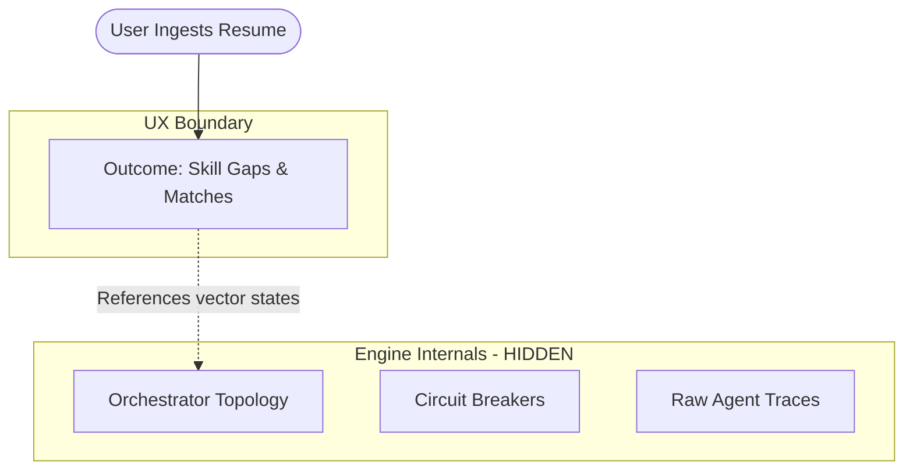

# ResuMatch UX Constitution: Product Boundary Rules

This document establishes the official product boundary rules and user experience guidelines for the ResuMatch platform. Its primary goal is to prevent **engineering leakage**—the exposure of internal runtime diagnostics, orchestration topologies, and resilience details as primary user interfaces.

ResuMatch must always present itself as a **premium, outcome-oriented career intelligence platform**, not an experimental systems sandbox.

---

## ⚖️ The Core Tenet: Outcome Over Internals

User-facing pages must remain focused on user outcomes, guidance, opportunities, and strategic decisions.

---

## 📜 Strict UX Boundary Rules

### 1. User-facing pages must be outcome-oriented
Users do not care about raw parsing processes, token counts, or vector databases. They care about their market readiness, target compensation, and high-ROI milestones. Always frame metrics, signals, and insights in the context of career progression.

### 2. Internal orchestration systems remain hidden
Abstractions like *Causal Graphs*, *Propagation Logs*, and *Orchestrator Topologies* must never be the primary interface for standard users. These developer diagnostics belong strictly in the developer console.

### 3. Diagnostics must NEVER become primary UX
Telemetry is powerful, but exposing raw logs, failure modes, or trace data by default decreases the premium feel of the product. Standard views should display polished dashboards. Diagnostic telemetry is reserved for **Developer Mode** (toggled via URL parameter `?dev=true` or the footer switch).

### 4. New features require three-step validation
Before adding any new page, widget, or subsystem to the navigation:
- **User Value Justification**: What specific career decision does this feature help the user make?
- **UX Placement Reasoning**: Can this information be consolidated into an existing dashboard rather than starting a new route?
- **Aggregation Analysis**: How does this coordinate with the primary Mission Control dashboard to preserve cross-page continuity?

### 5. Preference for Synthesis over Proliferation
ResuMatch prioritizes clean synthesis over feature fragmentation:
- **Consolidation**: Merge isolated dashboards (e.g. general recommendations, matches, and logs) into the primary `/dashboard` workspace.
- **Synthesis**: Calculate higher-level confidence ratings instead of exposing raw mathematical signals directly.
- **Aggregation**: Keep the navigation menu focused on the **7 Primary Views** (Dashboard, Roadmap, Opportunities, Market Intel, AI Workspace, Resumes, Public Profile) and collapse other features into expandable panels.

---

## 🛠️ Developer Mode Diagnostics Grouping

If a system diagnostic tool or real-time orchestration graph is useful for engineering demonstrations, place it inside the **Developer Diagnostics** group in the sidebar. This group must remain hidden by default, visible only to developers with `devMode` active.

> [!WARNING]
> Exposing internal pipeline names (e.g., `v1/roadmap-intel/node/defer`) directly to standard users or letting raw system failure labels leak into telemetry screens violates this Constitution.
