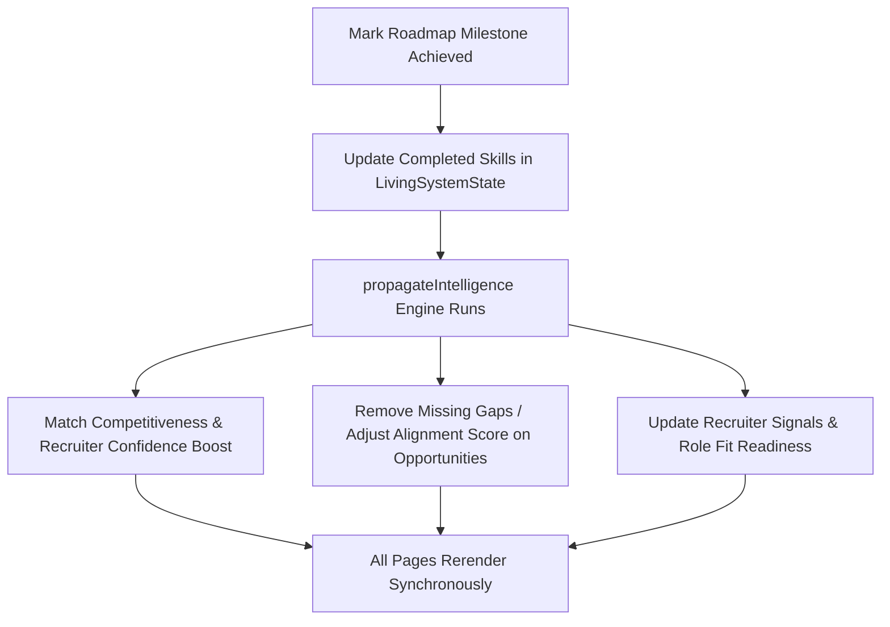

# Guided Intelligence Flow & User Lifecycle Architecture

This document defines the state management, intelligence propagation, and layout design standards for the ResuMatch career operating system.

---

## 1. User Lifecycle Stages

ResuMatch organizes user experiences around a 4-stage progression flow. The frontend components dynamically adapt metrics, dashboards, and features based on the active stage:

| Stage | Name | Target State / Behaviors |
| :--- | :--- | :--- |
| **Stage 1** | Onboarding & Standing By | The default state for a brand-new user. Emphasizes resume upload calls-to-action. Dashboards show uncalibrated placeholder fallbacks with clear alerts to seed profile credentials. |
| **Stage 2** | Parsing & Modeling | Triggers immediately when a portfolio file is ingested. Displays processing state, simulation loaders, and status alerts while the trajectory engine synthesizes vectors. |
| **Stage 3** | Profile Calibrated | The profile is successfully aligned to a target role. The roadmap nodes, opportunity matches, and market trend parameters are fully populated based on active skills. |
| **Stage 4** | Trajectory Optimized | The user has resolved high-priority gaps. AI Copilot features unlock advanced recommendations, predictive outlines, and detailed recruiter signal logs. |

---

## 2. Global State Ownership

All strategic data is unified and managed in one central location to prevent isolated pages from inventing independent mock values:

* **State Engine**: [LivingSystemContext.tsx](file:///d:/ResuMatch/frontend/src/context/LivingSystemContext.tsx)
* **Active Persona Catalog**: [baseline-profiles.ts](file:///d:/ResuMatch/frontend/src/data/baseline-profiles.ts)
* **Lifecycle State Model**: [user-lifecycle.ts](file:///d:/ResuMatch/frontend/src/state/user-lifecycle.ts)
* **Strategic State Model**: [strategic-profile.ts](file:///d:/ResuMatch/frontend/src/state/strategic-profile.ts)

---

## 3. Intelligence Propagation Rules

Changes to skills must propagate synchronously and causally across all views through the [intelligence-propagation.ts](file:///d:/ResuMatch/frontend/src/utils/intelligence-propagation.ts) engine:

### Dynamic Rules
1. **Specialization Ingestion**: Selecting a persona instantly imports its specific roadmap template (e.g. AI Engineer imports PyTorch/CUDA milestones, Cloud Engineer imports Kubernetes/Istio).
2. **Gap Resolution**: Completing a high-priority skill (e.g. Istio) removes it from outstanding gaps, boosts target opportunity alignment scores by **+8%**, and updates recruiter visibility signals.
3. **Stage Transitions**: Advancing to Stage 4 unlocks advanced recruiter panels and suggested copilot prompts.

---

## 4. Page Responsibilities & Hierarchy

Each page acts as a structured view consuming the unified state context:

### [Strategic Command Center](file:///d:/ResuMatch/frontend/src/app/(app)/dashboard/page.tsx)
Acts as the main operations board. Prioritizes information by strict strategic order:
1. **Primary Strategic Action**: Dynamic card prompting the exact next step based on the active lifecycle stage.
2. **High-Density Metrics**: Competitiveness, Recruiter Confidence, Market Fit, and Velocity cards.
3. **Current Trajectory**: Visual map showing specialization, target role, and outstanding gaps.
4. **Active Execution Sprint**: Core details of the first active roadmap milestone (rationales, dependencies).
5. **Market Movement & Recruiter Signals**: Real-time salary metrics and crawl matched recruiter logs.

### [Trajectory Roadmap](file:///d:/ResuMatch/frontend/src/app/(app)/roadmap-v2/page.tsx)
A 3-column workflow workspace allowing the user to view execution milestones, examine gap diagnostics, and complete/skip nodes to trigger immediate system recalculations.

### [Opportunities Matcher](file:///d:/ResuMatch/frontend/src/app/(app)/opportunities/page.tsx)
Displays open roles. Each role card lists **compensation metrics**, **recruiter pressure indices**, **hiring window times**, **stack compatibility**, and an explicit explanation detailing **why this role is relevant**.

### [AI Workspace](file:///d:/ResuMatch/frontend/src/app/(app)/workspace/page.tsx)
An interactive advisor. Contains custom welcome briefs tailored to target roles and outstanding skill gaps. Displays suggested prompts chips to quickly launch learning guides for active milestones.

---

## 5. Strategic Continuity Rules

1. **No Fragmented Mock Data**: Do not construct local state placeholders in new page layouts. Always add baseline personas to `baseline-profiles.ts` and import them into `LivingSystemContext.tsx`.
2. **Zero Empty States**: In Stage 1 (dormant), views must load dimmed baseline templates with clear instructions and warning banners, rather than blank empty page structures.
3. **Recruiter Demo Mode**: Keep the active persona and lifecycle selector in the AppShell footer to allow recruiters/evaluators to immediately demonstrate real-time propagation across all features.
